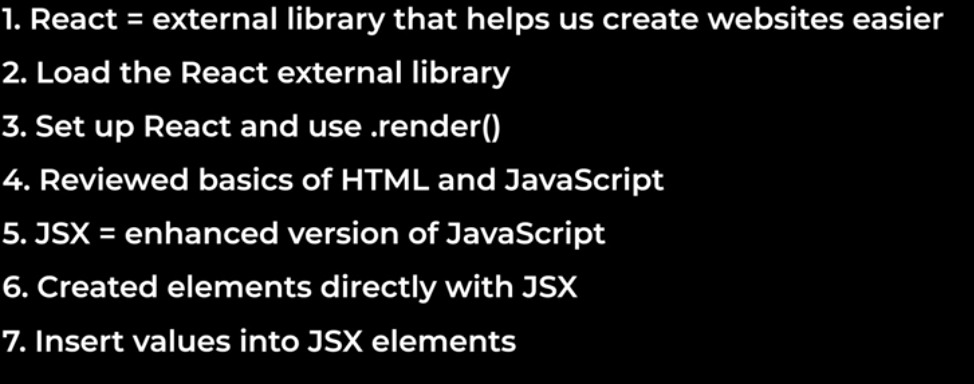

# ReactJs Badge 

This project is a simple ReactJS application designed to demonstrate the use of badges in a web interface.

## Features

- Display badges with dynamic content
- Responsive and modern UI
- Easy to customize and extend

## Installation

```bash
git clone https://github.com/your-username/ReactJs-bage.git
cd ReactJs-bage
npm install
```

## Usage

Start the development server:

```bash
npm start
```

Open [http://localhost:3000](http://localhost:3000) to view the app in your browser.

## Folder Structure

```
ReactJs-bage/
├── public/
├── src/
│   ├── components/
│   ├── App.js
│   └── index.js
├── package.json
└── README.md
```

## Technologies Used

- ReactJS
- CSS

## shots


## License

This project is licensed under the MIT License.
